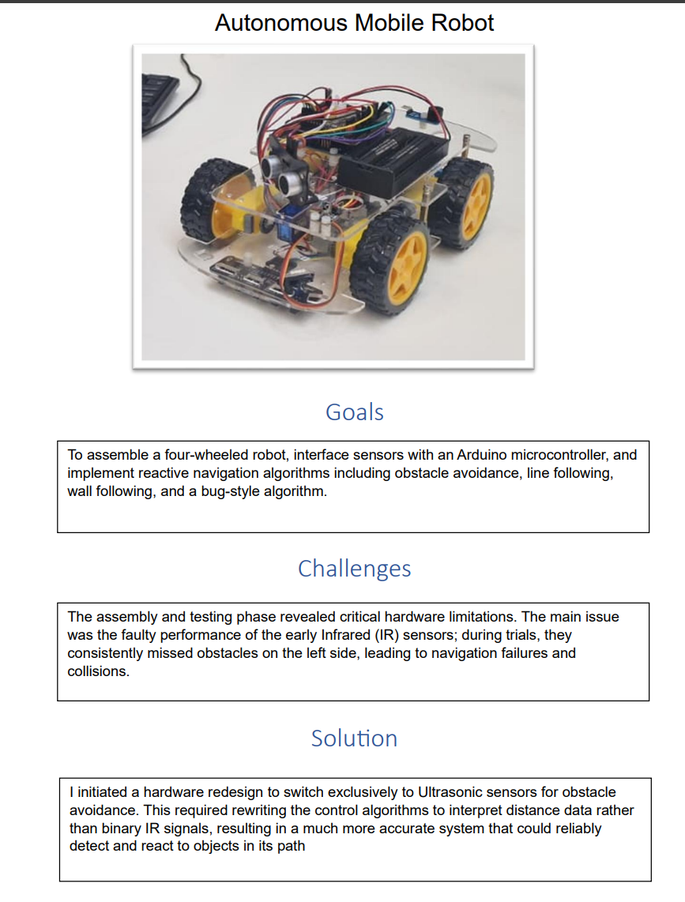
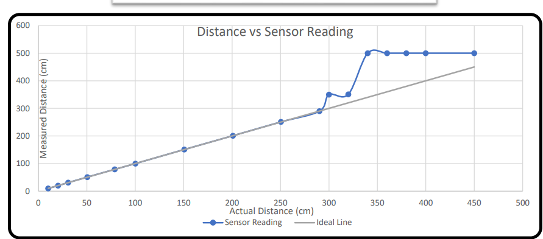

# Autonomous Mobile Robot: Multi-Modal Navigation & Path Planning

## 🎯 Overview
This repository contains the firmware for a 4-wheeled autonomous robot capable of complex navigation in dynamic environments .The system implements a modular state-machine architecture to switch between various robotic behaviors, ranging from simple reactive obstacle avoidance to complex path-planning algorithms like the **Bug Algorithm**.



## 🧠 Navigation Logic (The "Bug" Algorithm)
The highlight of this project is **Mode 4: The Bug Algorithm**. This algorithm allows the robot to navigate towards a goal while handling unexpected obstacles by transitioning through two primary states:

1. **State 0 (Goal Seeking):** The robot moves forward towards a predefined target
2. **State 1 (Wall Following):** Upon detecting an obstacle within **20cm**, the robot triggers an audible alert and switches to a wall-following behavior to "circumnavigate" the object.
3. **Recovery:** Once the front path is clear for a set duration, the robot resets its state to continue towards the goal

---

## 🛠️ Hardware Specifications
| Component | Specification / Pin | Function |
| :--- | :--- | :--- |
| **Microcontroller** | Arduino | [Central Logic Processing. |
| **Distance Sensor** | HC-SR04 Ultrasonic | Real-time obstacle detection (Trig: 10, Echo: 2). |
| **Actuator** | Micro Servo (SG90) | [Provides 180° environmental scanning capability. |
| **Line Sensor** | 5-Channel IR Array | High-precision surface tracking (A0-A4). |
| **Drive System** | L298N / DC Motors | Differential drive with PWM speed control. |

---

## 🔬 Perception & Sensor Calibration
During development, I identified a critical limitation with standard Infrared (IR) sensors, which often failed to detect objects at certain angles .I resolved this by transitioning to an **Ultrasonic-first perception model**.

### **Sensor Accuracy Analysis**
I performed rigorous testing to map "Actual Distance" vs. "Sensor Reading" to ensure navigation reliability.



---

## 💻 Code Architecture
The software is organized into functional blocks to ensure scalability:
* **`obstacleAvoidance()`**: Implements "Scan-Compare-Turn" logic .If the front path is blocked, the robot scans 30° right and 150° left to find the optimal path.
* **`wallFollowing()`**: Uses distance thresholds (**25cm**) and tolerances to maintain a steady course parallel to a wall.
* **`lineFollowing()`**: Utilizes a 5-sensor array to handle curves, sharp turns, and intersections.

### **Featured Snippet: State Switching**
```cpp
void bugAlgorithm() {
  if (bugState == 0) {
    if (frontDistance < OBSTACLE_STOP_DISTANCE) {
      bugState = 1; // Transition to Wall Follow
      buzz();
      stopMotors();
    } else {
      moveForward(NORMAL_SPEED);
    }
  } else {
    wallFollowing(); // Perimeter navigation
  }
}
